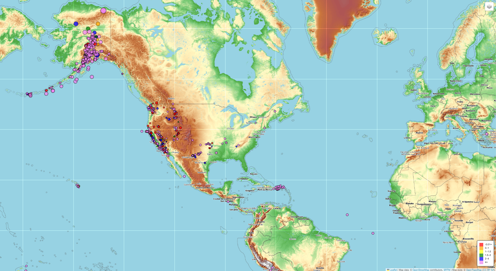
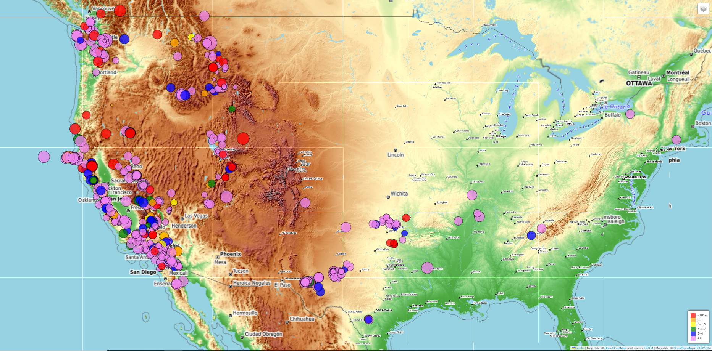

# leaflet-challenge
Data Analytics Course Module 15

# Task
I will build a Leaflet map to visualize earthquake data from a United States Geological Survey (USGS) GeoJSON dataset of earthqake data from the last 7 days.

# Methodology
Using starter index.html as well as a an logic.js file, I will use JavaScript and the D3 library to edit the HTML site and D3.json to fetch data. I'll edit the JavaScript, HTML, and CSS files to create markers that reflect the magnitude of the earthquakes by their size and the depth of the earthquake by color. This will also require creating a legend showing depth and corresponding colors. Popups will provide context for the map data.

## Results
**Note: Use logicv2.js to display the HTML site correctly.**

Leaflet Map View 1: United States, earthquakes from the past 7 days

Leaflet Map View 1: United States(lower 48), earthquakes from the past 7 days

## Analysis

A preliminary look at the map would indicate that a majority of the earthquakes are at a depth of 4+ km. The earthquakes are primarly located on the western coast of North America but are spread throughout the western half of the United States and through the center of Alaska.
